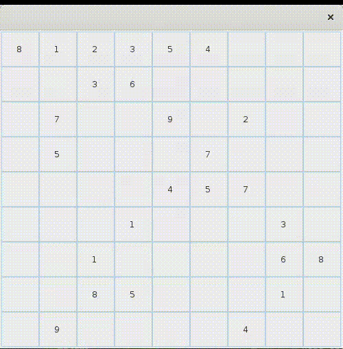

# Solver

- The solver uses backtracking. It is able to solve puzzle games based on rectangular board, where the player has to
  deduce missing digits. The most known game is the Sudoku for example.
- You only have to update the "Main" class with the grid you would like to solve. Set "-1" for empty cell.
- Two ways of displaying are available: through console of through JFrame. See the `DisplayStrategy` interface.
- To solve another Game, you only have to extend the abstract class `GridValidator`. The solver will manage the rest.
- To sum-up: the solver needs to know the game name (see `GameName` enumeration), the board inputs, and the
  displayStrategy. **That's all**.

## Sudoku

You know this game. :-)

## Binero

The Binero is a derivative of sudoku, where the boxes contain only 0 and 1.

Here are the rules:

- Each row and column must contain as much as 1 to 0.
- It can't be more than two 0 or two 1 following.
- There can not be two identical lines or two identical columns.

